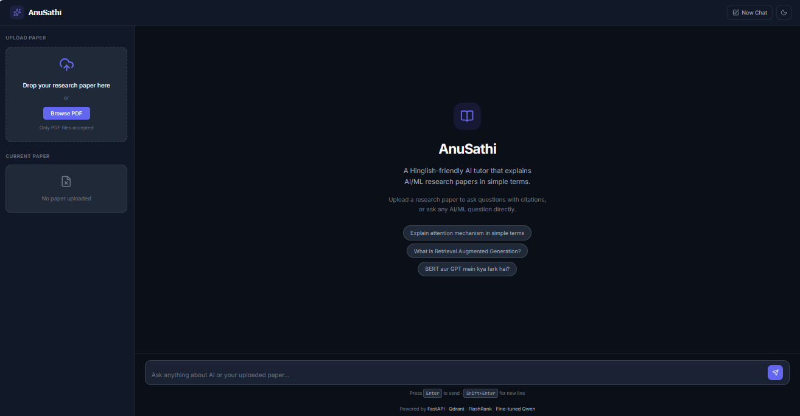
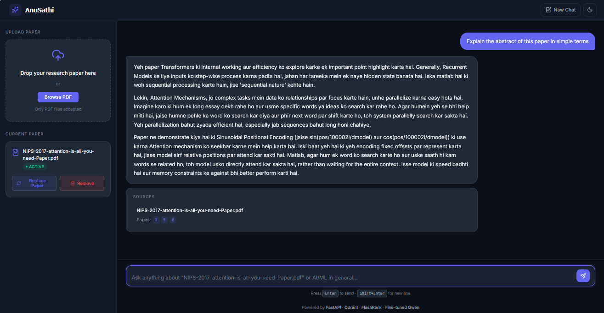
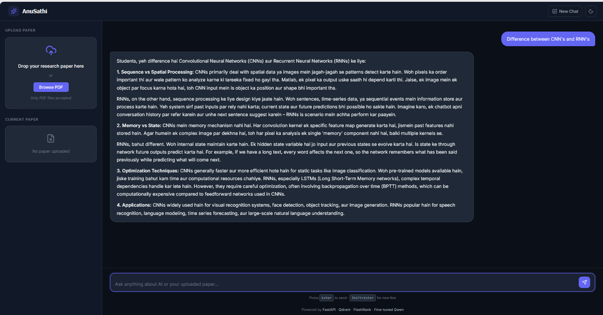

## 📖 Project Overview

**AnuSathi** is an AI-powered research paper explainer that makes AI/ML research papers easier to understand through simple Hinglish explanations. At its core is a **fine-tuned Qwen language model**, trained on a custom instruction dataset specifically designed to explain research concepts in an accessible teacher-like style.

To provide grounded and context-aware answers, AnuSathi integrates a **Retrieval-Augmented Generation (RAG)** pipeline built with Qdrant vector search and FlashRank reranking. Users can upload a research paper, ask natural language questions, and receive explanations supported by page-level citations from the uploaded document. When no paper is provided, AnuSathi also serves as a general AI/ML learning assistant.

The project demonstrates the complete workflow of building an end-to-end LLM application—from custom dataset creation and model fine-tuning to retrieval, backend API development, and an interactive web interface.


## ✨ Features

| Feature | Status |
|---------|:------:|
| 🤖 Fine-tuned **Qwen2.5-1.5B-Instruct** using **Unsloth LoRA** for teacher-style Hinglish research paper explanations | ✅ |
| 💬 Retrieval-Augmented Generation (RAG) with grounded, context-aware responses | ✅ |
| 🔄 Automatic PDF processing and indexing on upload | ✅ |
| 🧩 Semantic text chunking for efficient retrieval | ✅ |
| 🧠 Sentence Transformer embeddings | ✅ |
| 🗄️ Qdrant vector database integration | ✅ |
| 📊 FlashRank reranking for improved context retrieval | ✅ |
| 🔍 **Document-based filtering**, ensuring retrieval is restricted to the currently uploaded research paper | ✅ |
| 📑 Page-level citation support | ✅ |
| 🌐 General AI/ML assistant mode (without uploaded paper) | ✅ |
| ⚡ FastAPI REST API backend | ✅ |
| 🎨 Modern responsive frontend with drag-and-drop PDF upload and chat interface | ✅ |


## 🛠️ Tech Stack

### 🤖 AI / Machine Learning


---

### ⚙️ Backend


---

### 🔍 Retrieval & Vector Search


---

### 🌐 Frontend


---

### 📄 Document Processing


---

### 🛠️ Development Tools


### Training Details

| Component | Details |
|-----------|---------|
| **Base Model** | Qwen2.5-1.5B-Instruct |
| **Fine-tuning Method** | QLoRA (LoRA adapters with 4-bit quantization) using Unsloth |
| **Training Framework** | Unsloth, Hugging Face Transformers, TRL, PEFT |
| **Dataset** | ~800 custom instruction-response pairs generated from AI/ML research papers |
| **Quantization** | 4-bit QLoRA (training) |
| **Inference** | Hugging Face Transformers (merged 16-bit model) |


     
## 🏗️ System Architecture

```text
                           ┌────────────────────────────────────┐
                           │            FRONTEND (Antigravity)  │
                           │ HTML • CSS • Vanilla JavaScript    │
                           │                                    │
                           │ • PDF Upload                       │
                           │ • Chat Interface                   │
                           │ • Citation Cards                   │
                           │ • Dark / Light Theme               │
                           └────────────────────────────────────┘
                                          │
                               HTTP (Fetch API / JSON)
                                          │
                                          ▼
┌────────────────────────────────────────────────────────────────────────────┐
│                             FASTAPI BACKEND                               │
│                                                                            │
│  ┌──────────────┐      ┌──────────────────────┐      ┌─────────────────┐  │
│  │ Upload Route │────► │ PDF Processing       │────► │ Sentence         │  │
│  │  /upload     │      │                      │      │ Transformers     │  │
│  │              │      │ • PDF Loader         │      │ Embedding Model  │  │
│  │              │      │ • Semantic Chunking  │      └────────┬────────┘  │
│  └──────────────┘      └──────────────────────┘               │           │
│                                                                ▼           │
│                                                    ┌────────────────────┐  │
│                                                    │ Qdrant Vector DB   │  │
│                                                    │ Vector Storage     │  │
│                                                    └────────┬───────────┘  │
│                                                             │              │
│  ┌──────────────┐                                           ▼              │
│  │ Query Route  │────────────────────────────► Semantic Retrieval          │
│  │  /query      │                              + FlashRank Re-ranking      │
│  └──────────────┘                                           │              │
│                                                             ▼              │
│                                            Document-Scoped Retrieval       │
│                                                             │              │
│                                                             ▼              │
│                                     Fine-tuned Qwen2.5-1.5B-Instruct       │
│                                            (Unsloth LoRA)                  │
│                                                             │              │
│                                                             ▼              │
│                                         Answer + Page Citations            │
└────────────────────────────────────────────────────────────────────────────┘
```

---

## 📄 Upload Pipeline

```text
                      PDF Upload
                           │
                           ▼
                 Validate PDF File
                           │
                           ▼
                 Extract PDF Content
                           │
                           ▼
                 Semantic Chunking
                           │
                           ▼
        Generate Sentence Embeddings
                           │
                           ▼
          Store Vectors in Qdrant
                           │
                           ▼
            Return document_id
```

---

## 💬 Question Answering (RAG Flow)

```text
                    User Question
                           │
                           ▼
             Is a Paper Uploaded?
              ┌────────────┴────────────┐
              │                         │
             YES                       NO
              │                         │
              ▼                         ▼
      Embed User Query        General AI/ML Chat
              │                         │
              ▼                         ▼
     Search Qdrant Vector DB    Fine-tuned Qwen
              │
              ▼
    Document-Scoped Retrieval
              │
              ▼
    FlashRank Re-ranking
              │
              ▼
 Build Context from Top Chunks
              │
              ▼
 Fine-tuned Qwen2.5-1.5B-Instruct
              │
              ▼
   Answer + Page-Level Citations
              │
              ▼
     Return JSON to Frontend
```


## 📂 Project Structure

```text
AnuSathi/
│
├── backend/
│   ├── app/
│   │   ├── ingestion/
│   │   │   ├── chunking/              # Semantic text chunking
│   │   │   ├── loaders/               # PDF loading utilities
│   │   │   └── processor.py           # Upload → Chunk → Embed → Index pipeline
│   │   │
│   │   ├── routes/
│   │   │   ├── upload.py              # PDF upload endpoint
│   │   │   └── query.py               # Question-answering endpoint
│   │   │
│   │   ├── schemas/                   # Request & response models
│   │   │
│   │   ├── services/
│   │   │   ├── llm/                   # Fine-tuned Qwen inference
│   │   │   └── retrieval/
│   │   │       ├── embeddings.py      # Sentence-Transformer embeddings
│   │   │       ├── qdrant_service.py  # Qdrant vector operations
│   │   │       ├── reranker.py        # FlashRank reranking
│   │   │       ├── retriever.py       # Semantic retrieval pipeline
│   │   │       └── prompt_builder.py  # RAG prompt construction
│   │   │
│   │   ├── config.py                  # Application configuration
│   │   └── main.py                    # FastAPI entry point
│   │
│   ├── Data/                          # Local development papers (.gitkeep)
│   ├── processed_data/                # Generated chunk metadata (ignored by Git)
│   ├── requirements.txt
│   └── .env
│
├── frontend/
│   ├── index.html                     # Main user interface
│   ├── style.css                      # Application styling
│   └── app.js                         # Frontend logic & API communication
│
├── training/
│   ├── dataset/
│   │   └── train.json                 # Custom Hinglish instruction dataset
│   │
│   ├── Anusathi_Finetuned_Qwen2_5_1_5B_Instruct.ipynb
│   │                                   # Unsloth LoRA fine-tuning notebook
│   │
│   └── README.md                       # Fine-tuning documentation
│
├── README.md                           # Project documentation
├── AGENTS.md                           # AI coding instructions
└── DESIGN.md                           # Frontend UI/UX specification
```

## 🚀 Installation Guide

### Prerequisites

- Python **3.11**
- Git
- Hugging Face Account & Access Token
- Qdrant Cloud Account (or local Qdrant instance)
- 3 GB+ free disk space (base model weights+ LoRa Adapters)

---

### 1️⃣ Clone the Repository

```bash
git clone https://github.com/vansh-virmani/AnuSathi.git

cd AnuSathi
```

---

### 2️⃣ Create a Virtual Environment

```bash
cd backend

python -m venv .venv
```

**Windows**

```bash
.venv\Scripts\activate
```

**Linux / macOS**

```bash
source .venv/bin/activate
```

---

### 3️⃣ Install Dependencies

```bash
python -m pip install -r requirements.txt
```

---

### 4️⃣ Configure Environment Variables

Create a `.env` file inside the **backend** directory.

```env
# Hugging Face Access Token
HF_TOKEN=your_huggingface_access_token

#  Fine-tuned Model Repository
HF_MODEL=vanshvirmani1/finetuned-qwen-merged

# Qdrant Configuration
QDRANT_ENDPOINT=your_qdrant_cloud_endpoint
QDRANT_KEY=your_qdrant_api_key
QDRANT_COLLECTION_NAME=research_papers
```

> **Model Repository:**  
> https://huggingface.co/vanshvirmani1/finetuned-qwen-merged

> **Qdrant Setup:**  
> Create a free Qdrant Cloud cluster and provide its endpoint and API key above. AnuSathi automatically creates the required collection during the first document upload.


### 5️⃣ Run the Application

```bash
uvicorn app.main:app --reload
```

---

### 6️⃣ Open in Browser

Visit

```
http://localhost:8000
```

The frontend is served directly by FastAPI, so no separate frontend server is required.

---

### 📥 First Startup

During the first launch, AnuSathi automatically downloads the required models from Hugging Face and caches them locally.

This includes:

- Fine-tuned **Qwen2.5-1.5B-Instruct**
- **Sentence Transformers** embedding model
- **FlashRank** reranker model

This download happens only once. Subsequent launches reuse the cached models for significantly faster startup.

---

### 📄 Using the Application

1. Open **http://localhost:8000**
2. Upload an AI/ML research paper in **PDF** format.
3. Wait while the document is parsed, chunked, embedded, and indexed into Qdrant.
4. Ask questions about the uploaded paper.
5. Receive teacher-style Hinglish explanations with page-level citations.
6. Remove or replace the paper at any time to begin a new RAG session.

## 📡 API Endpoints

| Method | Endpoint | Purpose |
|---------|----------|---------|
| **POST** | `/upload` | Upload and index a research paper |
| **POST** | `/query` | Query the uploaded paper using RAG or General AI mode |

## 🚀 Future Improvements

- **Agentic RAG Pipeline** – Enable multi-step reasoning with planning, retrieval refinement, and iterative answer generation for complex research questions.
- **Guardrails & Safety** – Add hallucination detection, prompt injection protection, and response validation for more reliable outputs.
- **Improved Embedding Models** – Experiment with higher-quality embedding models (e.g., BAAI BGE-large, Nomic Embed, or multilingual embeddings) to improve retrieval accuracy.
- **Hybrid Search** – Combine dense vector search with keyword-based (BM25) retrieval for better recall on technical terms and equations.
- **Multi-Paper Knowledge Base** – Allow users to upload and query multiple research papers simultaneously with cross-document retrieval.
- **Streaming Responses** – Stream token-by-token responses for a smoother conversational experience.
- User authentication
- Support for additional research domains

## 📸 Screenshots

### 🏠 Home Interface

The landing page introduces AnuSathi and allows users to either upload a research paper or ask general AI/ML questions.



---

### 📄 Paper-Aware RAG Mode

After uploading a research paper, AnuSathi retrieves relevant document chunks from Qdrant and generates grounded teacher-style Hinglish explanations with page-level citations.



---

### 🤖 General AI Mode

When no research paper is uploaded, AnuSathi automatically switches to General AI mode and answers AI/ML questions using the fine-tuned model without document retrieval.




## 📄 License

This project is licensed under the **MIT License**. See the [LICENSE](LICENSE) file for details.
